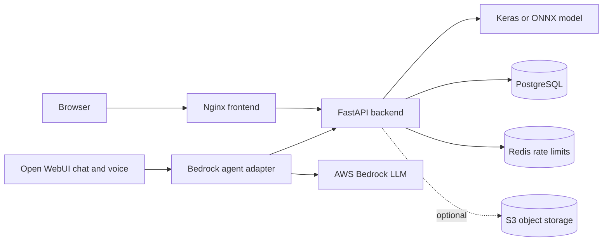

# Architecture

The model loads once during backend startup. A successful inference is persisted with its hash, Top-K result, latency, model version, and optional S3 URI. The agent obtains operational answers only through backend tools. PostgreSQL, Redis, and Open WebUI use persistent Docker volumes.
